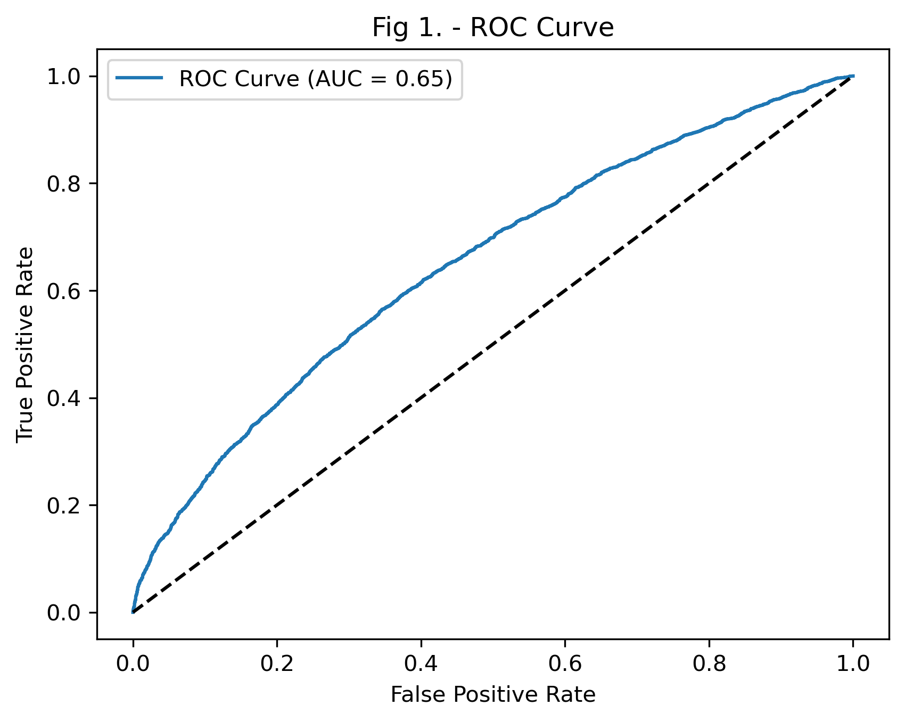
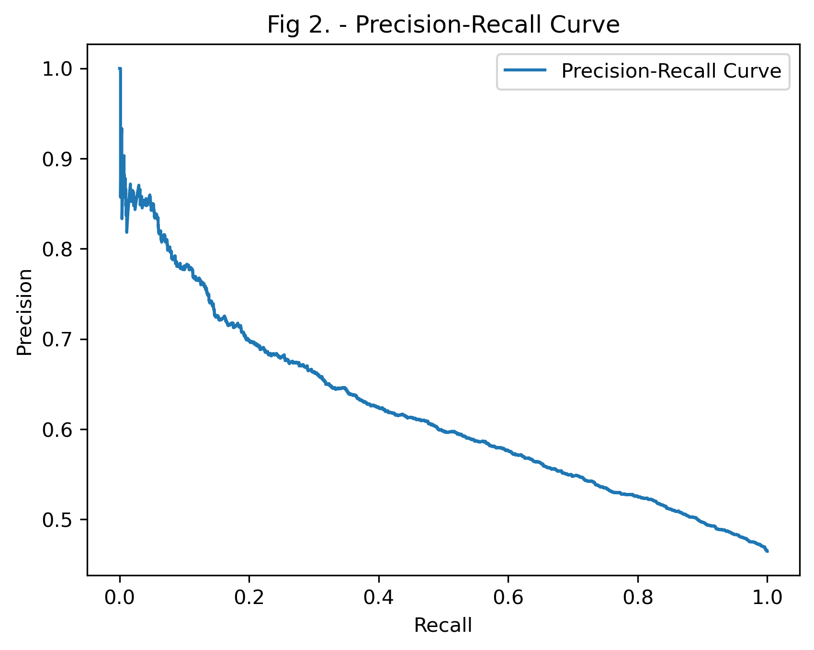

## Dataset

This dataset, hospital_readmissions.csv, is a public Kaggle subset of the UCI "Diabetes 130-US Hospitals" data. It contains 25,000 patient records with 16 features (such as age, time in hospital, number of procedures and medications, and prior visits) and a 30-day readmission label.

## Python Code

- [View Diabetic Readmission Notebook](https://github.com/kvellian/diabetes_readmission/blob/main/assets/path/DSC540_FinalProject_KenVellian.ipynb)
- [View Results of All 18 Experiments (CSV)](https://github.com/kvellian/diabetes_readmission/blob/main/assets/path/full_18_row_random_forest_results.csv)

## Purpose

This project aims to predict whether a diabetic patient will be readmitted to the hospital within 30 days, and to find which combination of feature selection methods and hyperparameters gives a Random Forest the best performance.

## Method

- **Preprocessing:** mapped categorical and ordinal features to integers and split the data 65/35 into training and test sets.
- **Feature selection:** compared low-variance filtering, Lasso, VIF, recursive feature elimination (RFE), wrapper selection, and univariate selection.
- **Model:** Random Forest (scikit-learn), tuned with GridSearchCV and RandomizedSearchCV.
- **Experiments:** logged 18 combinations of feature selection and tuning, scored with 5-fold cross-validation.

## Results

The best configuration reached **0.62 cross-validated accuracy and 0.66 AUC**. On the 8,750-record test set, accuracy was 0.61 and ROC-AUC was 0.65.

## Takeaways

Performance plateaued in the low 0.60s across all 18 experiments, which suggests the limit comes from the available features rather than the model or tuning. Richer clinical data (lab results, diagnosis detail, discharge notes) would likely matter more than further tuning.

Course: DSC 540 Advanced Machine Learning, DePaul University (Fall 2024).
